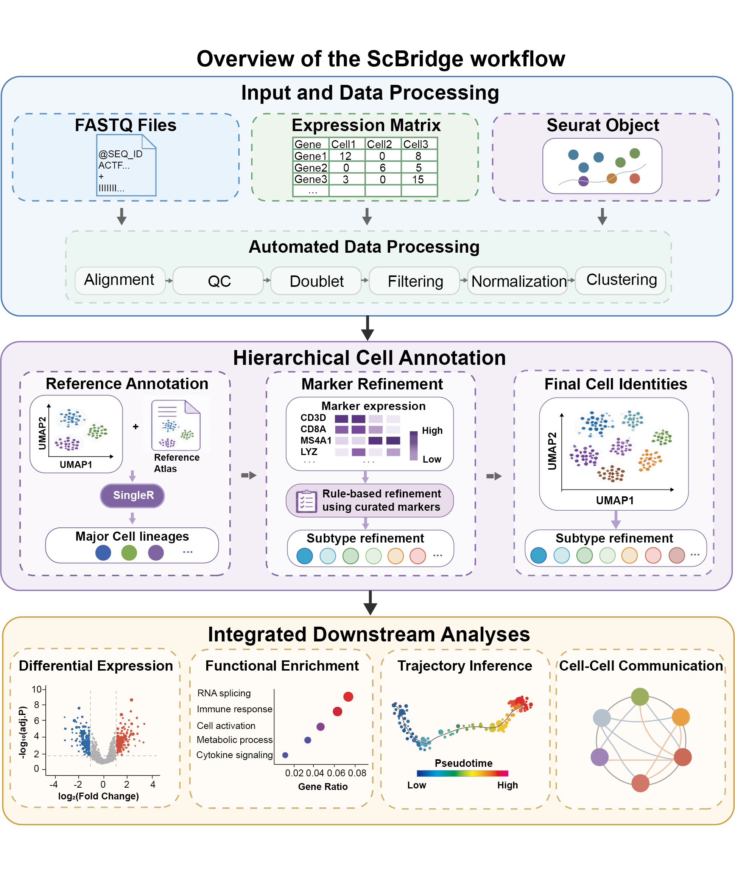

<p align="center">
  
</p>

<p align="center">
  <strong>A modular, containerized Snakemake workflow for end-to-end single-cell RNA-seq analysis.</strong>
</p>

ScBridge supports FASTQ, 10x matrix, and Seurat RDS inputs, combining
hierarchical cell-type annotation with comprehensive downstream analysis.

## Workflow Overview

<p align="center">
  
</p>

## Highlights

- **Flexible entry points:** FASTQ, 10x expression matrices, and Seurat RDS.
- **Stage-aware execution:** start from filtering, normalization, clustering, or annotation.
- **Raw-read processing:** FastQC and STARsolo for FASTQ input.
- **Hierarchical annotation:** SingleR/celldex followed by marker-based subtype refinement.
- **Integrated downstream analysis:** differential expression, enrichment, Monocle3, and CellChat.
- **Reproducible environment:** dependencies packaged in one Apptainer SIF image.

## Project at a Glance

| Component | Implementation |
|---|---|
| Workflow engine | Snakemake |
| Containerization | Apptainer with a SIF image |
| FASTQ processing | FastQC and STARsolo |
| Core analysis | Seurat-based QC, filtering, normalization, integration, and clustering |
| Annotation | SingleR/celldex major types plus marker-based subtype refinement |
| Downstream analysis | Differential expression, GO/KEGG enrichment, Monocle3, and CellChat |

## Installation

ScBridge requires a Linux system with Apptainer. R, Python, Conda, and workflow
packages are provided inside the image and do not need to be installed on the
host.

Build the image from the supplied definition file:

```bash
cd <PROJECT_DIR>

apptainer build --fakeroot scRNA_seq.sif \
  build/scRNA_seq.def
```

## Quick Start

The general command is:

```text
run_workflow -I fastq|matrix|rds [mode-specific input] \
  -C CONFIG -S METADATA -M MARKERS -R RESULTS [-t TASK]
```

### FASTQ Input

```bash
apptainer exec \
  -B <PROJECT_DIR>:/opt/scRNA_workflow \
  scRNA_seq.sif \
  bash /opt/scRNA_workflow/run_workflow \
    -I fastq \
    -F <FASTQ_DIR> \
    -C <CONFIG_FILE> \
    -S <METADATA_FILE> \
    -M <MARKER_FILE> \
    -R <RESULTS_DIR> \
    --star-index <STAR_INDEX_DIR> \
    -t <TASK>
```

If the STAR index does not exist, ScBridge can build it from the genome FASTA
and GTF paths defined in `config.yaml`.

### Matrix Input

```bash
apptainer exec \
  -B <PROJECT_DIR>:/opt/scRNA_workflow \
  scRNA_seq.sif \
  bash /opt/scRNA_workflow/run_workflow \
    -I matrix \
    -D <MATRIX_DIR> \
    -C <CONFIG_FILE> \
    -S <METADATA_FILE> \
    -M <MARKER_FILE> \
    -R <RESULTS_DIR> \
    -t <TASK>
```

### RDS Input

```bash
apptainer exec \
  -B <PROJECT_DIR>:/opt/scRNA_workflow \
  scRNA_seq.sif \
  bash /opt/scRNA_workflow/run_workflow \
    -I rds \
    -G <INPUT_STAGE> \
    -P <RDS_PATH> \
    -C <CONFIG_FILE> \
    -S <METADATA_FILE> \
    -M <MARKER_FILE> \
    -R <RESULTS_DIR> \
    -t <TASK>
```

For RDS mode, `-G` accepts `filtering`, `normalization`, `clustering`, or
`annotation`. The `-P` argument may point to a supported RDS file or a
multi-sample stage directory.

Replace each uppercase placeholder with an absolute path visible inside the
container. With the mount shown above, files under `<PROJECT_DIR>` are available
under `/opt/scRNA_workflow`.

## Inputs

| Argument | Scope | Requirement | Purpose |
|---|---|---|---|
| `-I, --input-mode` | All modes | Required | Input mode |
| `-F, --fastq-dir` | FASTQ | Mode-specific | FASTQ directory |
| `-D, --matrix-dir` | Matrix | Mode-specific | 10x matrix directory |
| `-G, --input-stage` | RDS | Mode-specific | RDS input stage |
| `-P, --stage-path` | RDS | Mode-specific | RDS file or stage directory |
| `-C, --config` | All modes | Required | Workflow configuration |
| `-S, --metadata` | All modes | Required | Sample metadata |
| `-M, --markerlist` | All modes | Required | Marker gene table |
| `-R, --results` | All modes | Required | Output directory |

Sample identifiers in the metadata must match the FASTQ, matrix, or RDS sample
names used by the selected input mode.

## Tasks

Use `-t, --task` to specify the workflow target. ScBridge automatically executes
all upstream stages required to produce the selected target.

| Task | Execution |
|---|---|
| `qc` | Quality control |
| `filtering` | Required stages through filtering |
| `normalization` | Required stages through normalization |
| `clustering` | Required stages through clustering |
| `annotation` | Required stages through cell-type annotation |
| `differential` | Required upstream stages + differential expression |
| `enrichment` | Required upstream stages + functional enrichment |
| `trajectory` | Required upstream stages + Monocle3 trajectory analysis |
| `cellchat` | Required upstream stages + CellChat communication analysis |
| `downstream` | All downstream analysis modules and their dependencies |
| `all` | All available final outputs from the selected input point |

## Main Outputs

Each analysis is isolated under the directory supplied with `-R`:

```text
<RESULTS_DIR>/
├── qc/
├── doublets/
├── filtering/
├── normalization/
├── batch_correction/
├── feature_selection/
├── clustered/
├── annotation/
│   ├── seurat_final_annotated.rds
│   ├── reports/
│   └── spreadsheets/
├── differential/
│   ├── reports/
│   └── spreadsheets/
├── enrichment/
│   ├── enrichment_summary.csv
│   ├── enrichment_results_all.rds
│   └── visualizations
├── monocle3/
│   ├── cds_object.rds
│   ├── trajectory_summary.rds
│   ├── trajectory_dependent_genes.csv
│   └── plot/
├── cellchat/
│   ├── plots/
│   └── spreadsheets/
├── reports/
│   └── standardization_report.txt
└── runtime/
    └── input manifests used by the workflow
```

Earlier-stage directories are created only when those stages are executed in
the current analysis.

## Documentation

The complete guide covers input preparation, configuration, command-line use,
pipeline stages, output interpretation, and troubleshooting:

* [Online documentation](https://scbridge.readthedocs.io/)
* [Documentation source](docs/index.md)

## Citation

Citation information will be added with the first public release.
